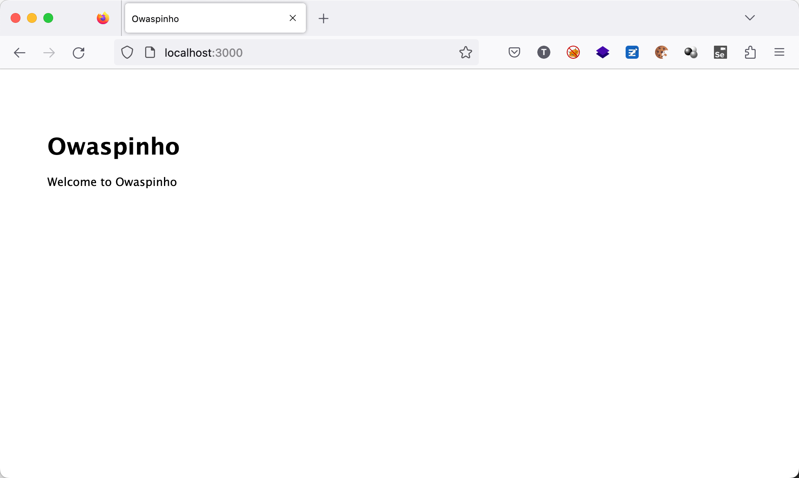

# OWASPinho
- [OWASPinho](#owaspinho)
  - [Execução](#execução)
  - [Vulnerabilidades](#vulnerabilidades)
    - [XSS](#xss)
    - [SQL Injection](#sql-injection)
    - [RCE](#rce)


## Desafio

Leia as instruções [aqui](DESAFIO.md).

## Execução

```
$ unzip owaspinho.zip
$ cd owaspinho
$ docker-compose up
```



